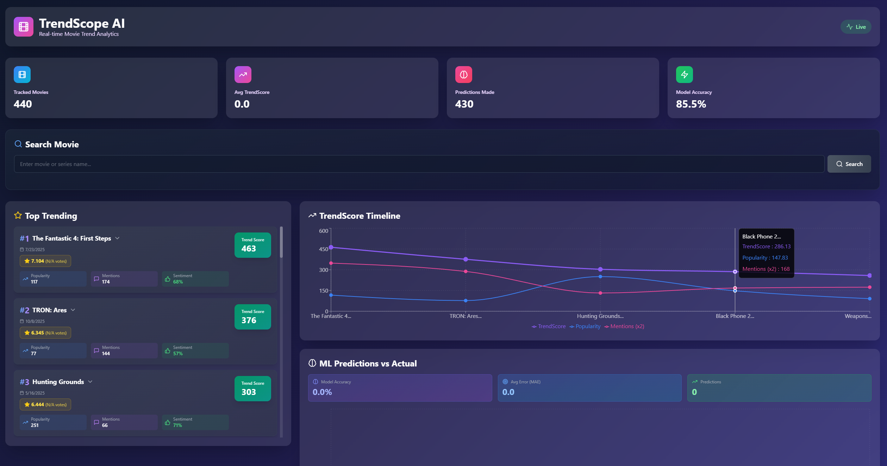
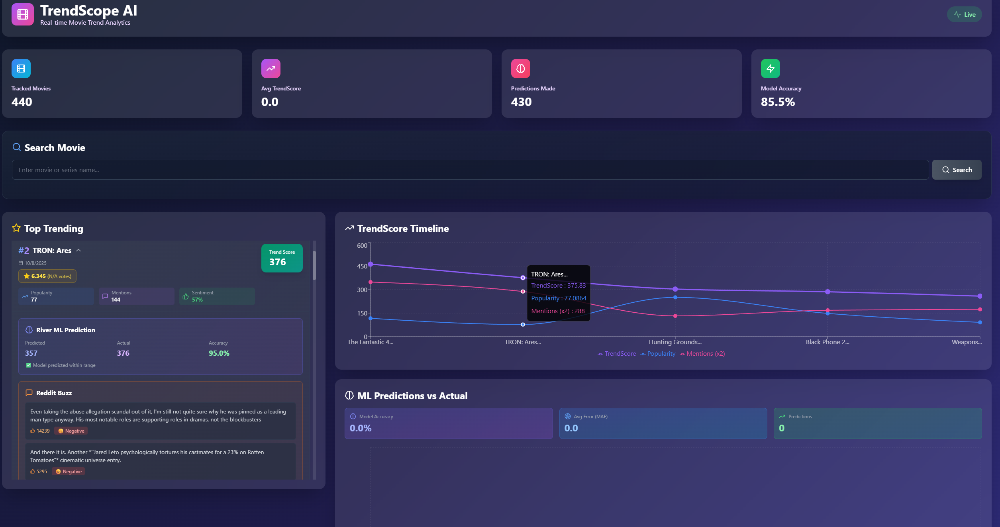

# 🎬 TrendScope-AI

**Real-Time Big Data & MLOps Platform for Movie Trend Analysis**

[](https://www.python.org/)
[](https://kafka.apache.org/)
[](https://spark.apache.org/)
[](https://www.docker.com/)
[](https://mlflow.org/)

---




## 📋 Table of Contents

- [Overview](#overview)
- [Architecture](#architecture)
- [Features](#features)
- [Prerequisites](#prerequisites)
- [Quick Start](#quick-start)
- [Configuration](#configuration)
- [Project Structure](#project-structure)
- [Components](#components)
- [Monitoring](#monitoring)
- [Development](#development)
- [Troubleshooting](#troubleshooting)
- [License](#license)

---

## 🎯 Overview

TrendScope-AI is an end-to-end real-time data streaming and analytics platform that monitors and predicts **movie trends** by combining:

- **Structured data** from The Movie Database (TMDB) API
- **Unstructured discussions** from Reddit (r/movies)

The platform demonstrates modern Big Data, MLOps, and real-time analytics capabilities:

✅ Real-time data ingestion with **Apache Kafka**  
✅ Stream processing with **Apache Spark Structured Streaming**  
✅ Adaptive predictions using **Online Machine Learning (River)**  
✅ MLOps pipeline with **MLflow**, **Evidently**, **Prometheus**, and **Grafana**  
✅ Fully containerized with **Docker Compose**

---

## 🏗️ Architecture

```
┌─────────────────────────────────────────────────────────────────┐
│                        DATA SOURCES                              │
│  ┌──────────────┐              ┌───────────────┐                │
│  │  TMDB API    │              │  Reddit API   │                │
│  │ (Structured) │              │ (Unstructured)│                │
│  └──────┬───────┘              └───────┬───────┘                │
└─────────┼──────────────────────────────┼────────────────────────┘
          │                              │
          ▼                              ▼
┌─────────────────────────────────────────────────────────────────┐
│                   INGESTION LAYER (Kafka)                        │
│  ┌──────────────┐              ┌───────────────┐                │
│  │TMDB Producer │─────────────▶│ tmdb_stream   │                │
│  └──────────────┘              └───────────────┘                │
│  ┌──────────────┐              ┌───────────────┐                │
│  │Reddit Producer│────────────▶│ reddit_stream │                │
│  └──────────────┘              └───────────────┘                │
└─────────────────────────────────────────────────────────────────┘
                         │
                         ▼
┌─────────────────────────────────────────────────────────────────┐
│              PROCESSING LAYER (Spark Streaming)                  │
│  • Parse & Clean JSON                                            │
│  • Sentiment Analysis (VADER)                                    │
│  • Windowed Aggregations                                         │
│  • Join TMDB + Reddit streams                                    │
│  • Compute TrendScore                                            │
│                                                                   │
│  TrendScore = w₁×Popularity + w₂×Mentions + w₃×Sentiment         │
└─────────────────────────────────────────────────────────────────┘
          │                              │
          ▼                              ▼
┌──────────────────┐         ┌───────────────────────┐
│   Cassandra DB   │         │   trend_stream        │
│  (Trend Data)    │         │   (Kafka Topic)       │
└──────────────────┘         └───────────┬───────────┘
                                         │
                                         ▼
┌─────────────────────────────────────────────────────────────────┐
│              ONLINE ML LAYER (River)                             │
│  • Consume trend_stream                                          │
│  • Extract features (popularity, sentiment, mentions)            │
│  • Predict TrendScore(t+Δ)                                       │
│  • Update model incrementally                                    │
│  • Track metrics (MAE, RMSE, R²)                                 │
└─────────────────────────────────────────────────────────────────┘
          │                              │
          ▼                              ▼
┌──────────────────┐         ┌───────────────────────┐
│   Cassandra DB   │         │ predictions_stream    │
│  (Predictions)   │         │   (Kafka Topic)       │
└──────────────────┘         └───────────────────────┘
                                         │
                                         ▼
┌─────────────────────────────────────────────────────────────────┐
│                 MONITORING & MLOPS LAYER                         │
│  ┌─────────┐  ┌──────────┐  ┌──────────┐  ┌─────────┐          │
│  │ MLflow  │  │Evidently │  │Prometheus│  │ Grafana │          │
│  │(Tracking)│  │ (Drift)  │  │(Metrics) │  │ (Viz)   │          │
│  └─────────┘  └──────────┘  └──────────┘  └─────────┘          │
└─────────────────────────────────────────────────────────────────┘
```

---

## ✨ Features

### 🔄 Real-Time Data Pipeline
- Continuous ingestion from TMDB and Reddit APIs
- Fault-tolerant message delivery with Kafka
- Stream processing with Spark Structured Streaming

### 🧠 Online Machine Learning
- Adaptive trend prediction using River
- Incremental model updates with each observation
- Feature engineering (temporal, delta, moving averages)

### 📊 Hybrid Data Integration
- Structured movie metadata (TMDB)
- Unstructured sentiment from Reddit discussions
- Real-time sentiment analysis with VADER

### 🎯 TrendScore Computation
Combines multiple signals:
- **Popularity** (TMDB metrics)
- **Mentions Rate** (Reddit activity)
- **Sentiment** (Audience reactions)

### 📈 Complete MLOps Pipeline
- Experiment tracking (MLflow)
- Data drift detection (Evidently)
- System monitoring (Prometheus)
- Real-time dashboards (Grafana)

### 🐳 Production-Ready Deployment
- Fully containerized with Docker Compose
- One-command deployment
- Scalable microservices architecture

---

## 🔧 Prerequisites

- **Docker** (version 20.10+)
- **Docker Compose** (version 2.0+)
- **TMDB API Key** ([Get it here](https://www.themoviedb.org/settings/api))
- **Reddit API Credentials** ([Create app here](https://www.reddit.com/prefs/apps))

---

## 🚀 Quick Start

### 1. Clone the Repository

```bash
git clone https://github.com/Aziz-Benamira/TrendScope-AI.git
cd TrendScope-AI
```

### 2. Configure Environment Variables

```bash
cp .env.example .env
```

Edit `.env` and add your API credentials:

```env
TMDB_API_KEY=your_tmdb_api_key_here
REDDIT_CLIENT_ID=your_reddit_client_id_here
REDDIT_CLIENT_SECRET=your_reddit_client_secret_here
REDDIT_USER_AGENT=TrendScope-AI/1.0
```

### 3. Run Setup Script

**On Linux/macOS:**
```bash
chmod +x setup.sh
./setup.sh
```

**On Windows (PowerShell):**
```powershell
.\setup.ps1
```

### 4. Access Dashboards

- **Grafana**: http://localhost:3000 (admin/admin)
- **MLflow**: http://localhost:5000
- **Prometheus**: http://localhost:9090
- **Spark UI**: http://localhost:8080

---

## ⚙️ Configuration

### TrendScore Weights

Adjust in `.env`:

```env
W1_POPULARITY=0.4   # Weight for TMDB popularity
W2_MENTIONS=0.3     # Weight for Reddit mentions
W3_SENTIMENT=0.3    # Weight for sentiment score
```

### Window Parameters

```env
TREND_WINDOW_DURATION=5 minutes
TREND_SLIDE_DURATION=1 minute
```

### Fetch Intervals

```env
TMDB_FETCH_INTERVAL=300    # 5 minutes
REDDIT_FETCH_INTERVAL=60   # 1 minute
```

---

## 📁 Project Structure

```
TrendScope-AI/
│
├── producers/              # Data ingestion services
│   ├── tmdb/              # TMDB API producer
│   │   ├── Dockerfile
│   │   ├── requirements.txt
│   │   └── tmdb_producer.py
│   └── reddit/            # Reddit API producer
│       ├── Dockerfile
│       ├── requirements.txt
│       └── reddit_producer.py
│
├── processors/            # Spark streaming jobs
│   ├── Dockerfile
│   ├── requirements.txt
│   └── spark_streaming_processor.py
│
├── ml_service/           # Online ML service
│   ├── Dockerfile
│   ├── requirements.txt
│   └── online_ml_service.py
│
├── storage/              # Database initialization
│   ├── requirements.txt
│   └── init_cassandra.py
│
├── monitoring/           # Monitoring & MLOps
│   ├── mlflow/
│   │   └── Dockerfile
│   ├── prometheus/
│   │   └── prometheus.yml
│   ├── grafana/
│   │   ├── provisioning/
│   │   └── dashboards/
│   └── drift_detection.py
│
├── configs/              # Configuration files
├── notebooks/            # Jupyter notebooks
├── tests/                # Unit tests
│
├── docker-compose.yml    # Orchestration
├── requirements.txt      # Python dependencies
├── .env.example         # Environment template
├── .gitignore
└── README.md
```

---

## 🔩 Components

### 1️⃣ Data Ingestion Layer

**TMDB Producer**
- Fetches trending movies every 5 minutes
- Publishes to `tmdb_stream` Kafka topic
- Includes: popularity, votes, metadata

**Reddit Producer**
- Streams r/movies comments in real-time
- Extracts movie mentions
- Publishes to `reddit_stream` Kafka topic

### 2️⃣ Processing Layer

**Spark Structured Streaming**
- Consumes both Kafka streams
- Applies VADER sentiment analysis
- Performs windowed aggregations (5-minute windows)
- Joins TMDB + Reddit data by movie title
- Computes TrendScore
- Writes to Cassandra and `trend_stream`

### 3️⃣ Online ML Layer

**River ML Service**
- Consumes `trend_stream`
- Extracts features (popularity, mentions, sentiment, temporal)
- Predicts next TrendScore using online regression
- Updates model incrementally
- Tracks MAE, RMSE, R² metrics
- Publishes predictions to `predictions_stream`

### 4️⃣ Storage Layer

**Cassandra**
- `movie_trends`: Processed trend data
- `predictions`: ML predictions and actuals
- `model_metrics`: Performance metrics

### 5️⃣ Monitoring Layer

**MLflow**: Experiment tracking, model versioning  
**Evidently**: Data drift detection  
**Prometheus**: Metrics collection  
**Grafana**: Real-time dashboards

---

## 📊 Monitoring

### Grafana Dashboard

Access at http://localhost:3000 (default: admin/admin)

**Panels:**
- ML Model MAE/RMSE trends
- Total predictions counter
- Prediction latency (p95)
- Predictions per minute

### MLflow Tracking

Access at http://localhost:5000

- View experiment runs
- Compare model performance
- Track parameters and metrics

### Prometheus Metrics

Access at http://localhost:9090

Key metrics:
- `ml_predictions_total`: Total predictions
- `ml_mae`: Mean Absolute Error
- `ml_rmse`: Root Mean Square Error
- `ml_prediction_seconds`: Prediction latency

---

## 🛠️ Development

### Running Individual Components

```bash
# Start only Kafka ecosystem
docker-compose up -d zookeeper kafka

# Start only producers
docker-compose up -d tmdb-producer reddit-producer

# View specific service logs
docker-compose logs -f ml-service
```

### Running Tests

```bash
# Install dev dependencies
pip install -r requirements.txt pytest pytest-mock

# Run tests
pytest tests/
```

### Rebuilding Services

```bash
# Rebuild specific service
docker-compose build tmdb-producer

# Rebuild and restart
docker-compose up -d --build tmdb-producer
```

---

## 🐛 Troubleshooting

### Kafka Connection Issues

```bash
# Check Kafka is running
docker-compose ps kafka

# View Kafka logs
docker-compose logs kafka

# Restart Kafka
docker-compose restart kafka
```

### Cassandra Not Ready

```bash
# Wait for Cassandra initialization
docker-compose logs -f cassandra

# Check Cassandra status
docker-compose exec cassandra nodetool status
```

### Reset Everything

```bash
# Stop and remove all containers
docker-compose down -v

# Start fresh
docker-compose up -d
```

---

## 📚 Additional Resources

- [Apache Kafka Documentation](https://kafka.apache.org/documentation/)
- [Apache Spark Structured Streaming](https://spark.apache.org/docs/latest/structured-streaming-programming-guide.html)
- [River Online ML](https://riverml.xyz/)
- [TMDB API Documentation](https://developers.themoviedb.org/3)
- [Reddit API Documentation](https://www.reddit.com/dev/api)

---

## 🎓 Academic Context

This project demonstrates:

✅ **Big Data Engineering**: Kafka, Spark, Cassandra  
✅ **Streaming Analytics**: Real-time data processing  
✅ **Machine Learning**: Online adaptive learning  
✅ **MLOps**: Monitoring, tracking, drift detection  
✅ **DevOps**: Containerization, orchestration

---

## 📝 License

This project is licensed under the MIT License - see the LICENSE file for details.

---

## 👥 Contributors

- **Aziz Benamira** - [GitHub](https://github.com/Aziz-Benamira)

---

**Built with ❤️ for real-time analytics and adaptive machine learning**
